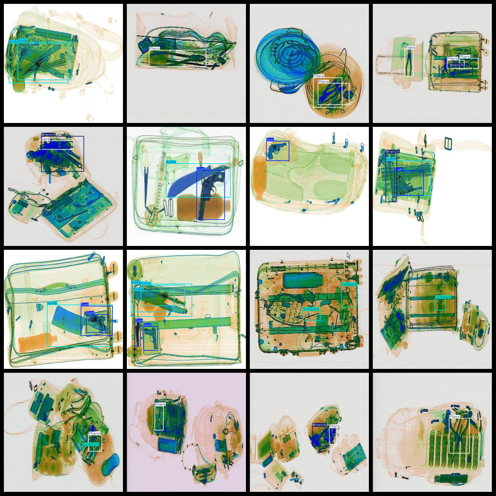
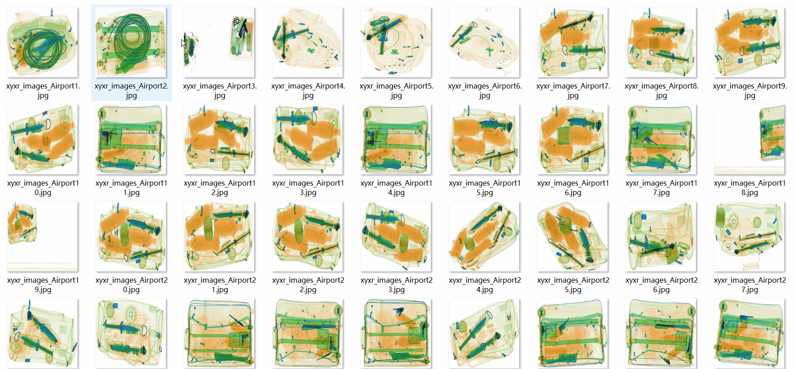

# Airport XLight Security Contraband Detection Dataset 8295 Images VOC+YOLO Format

The dataset consists of an airport X-ray security contraband detection dataset with 8295 images in the VOC+YOLO format. The dataset is available in Pascal VOC format and YOLO format, without the split paths in a txt file. It only includes JPG images along with their corresponding VOC format xml files and YOLO format txt files.

Number of images (JPG files): 8295
Number of annotations (xml files): 8295
Number of annotations (txt files): 8295
Number of categories: 5
Repository: datasets_sl

The number of categories in the annotation labels folder (not the same as the order in the yolo format): ["Gun", "Knife", "Pliers", "Scissors", "Wrench"]

The number of bounding boxes for each category:

- Gun: 4386 (gun)
- Knife: 2084 (knife)
- Pliers: 5314 (pliers)
- Scissors: 1105 (scissors)
- Wrench: 2779 (wrench)
Total bounding box count: 15668

The number of images per category:

- Gun: 2775
- Knife: 1352
- Pliers: 3907
- Scissors: 959
- Wrench: 2009
Image resolution: 640x640

Annotation tool used: labelImg

Dataset is not enhanced.
Annotation rules: draw bounding boxes for the categories.

Important note: The dataset does not have separate training, validation, or test sets; you will need to divide it yourself.

Special statement: This dataset does not guarantee any accuracy in the trained models or weight files.

Annotation and image details are as follows:

## Images

---

Here is a pay link on Stripe (https://buy.stripe.com/3cs8yP7sY87d0vu9AB). Please contact me lonlonago@foxmail.com after funding $89, and I will send you a complete data files, thank you!

